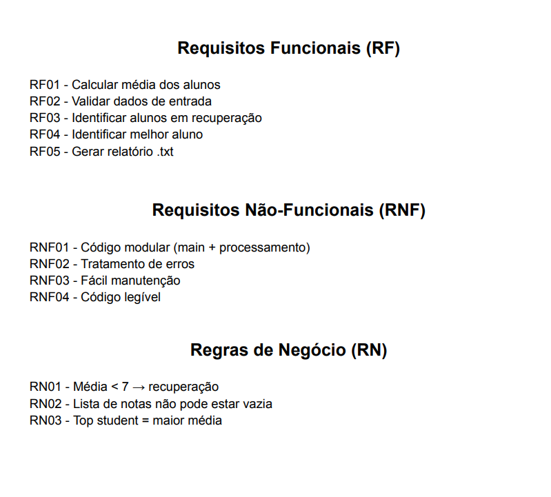
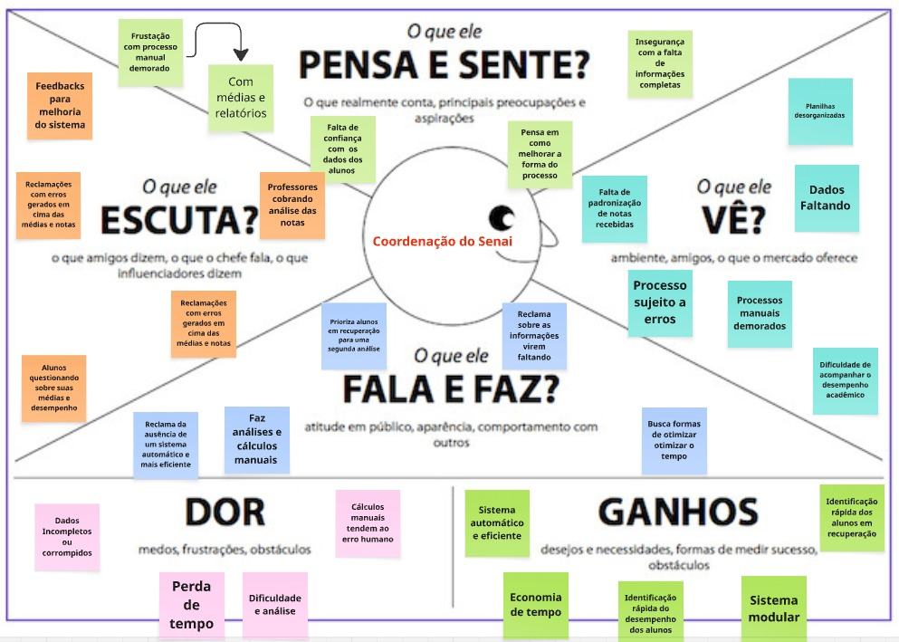
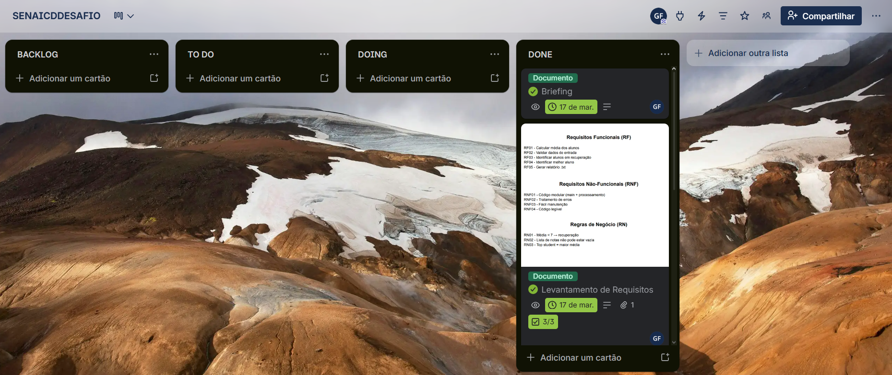

## LEVANTAMENTO DE REQUISITOS 
 - Levantamento de Requisitos do desafio que visa entender todos os itens obrigatórios de composição no projeto

----------------------------------------------------------------------------------------------------------------------------------------------------------------------------------------------------------------

## MAPA DE EMPATIA
 - Mapa da Empatia que visa entender as dores da coordenação de Senai que funciona como guia pra desenvolvimento do projeto

----------------------------------------------------------------------------------------------------------------------------------------------------------------------------------------------------------------

## DESIGN THINKING - KANBAN ( TRELLO )
 - KANBAN realizado no trello que tem o objetivo de organizar distribuição de tarefas de forma eficiente 

